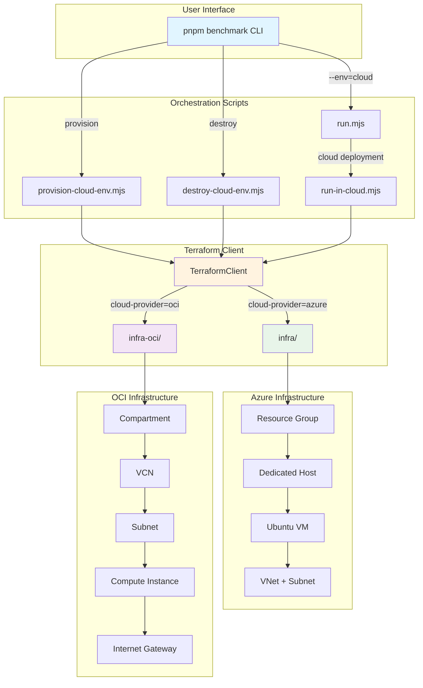
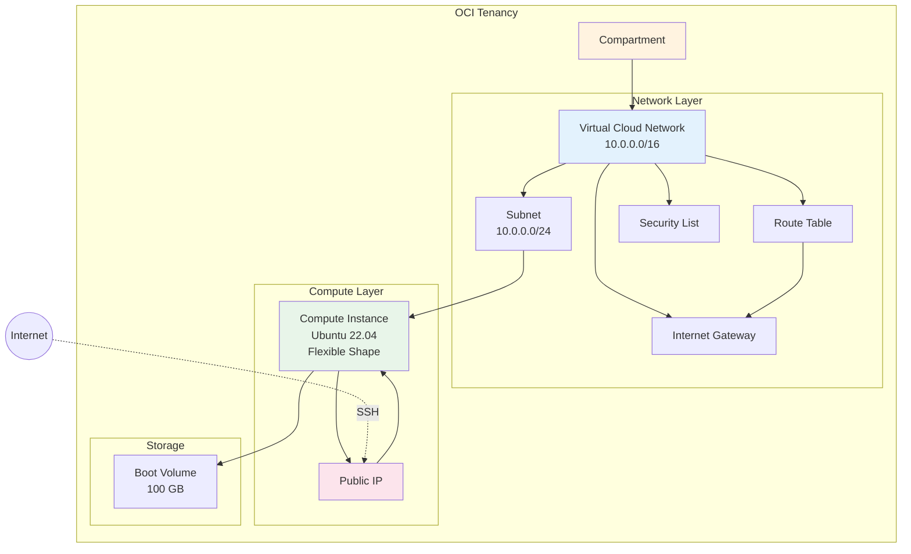
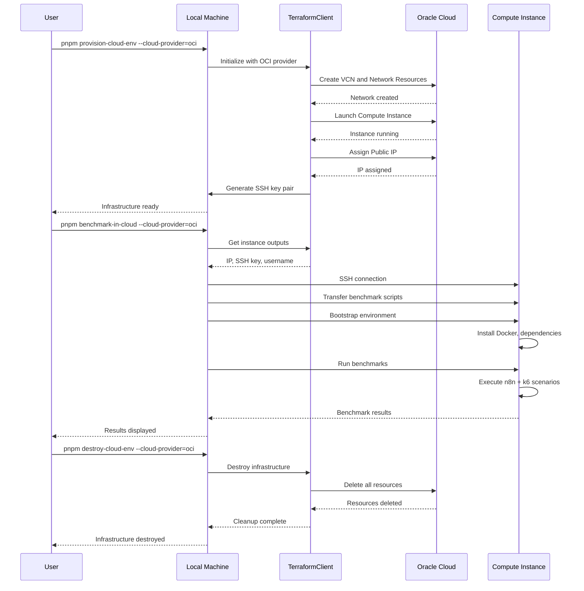

# n8n Benchmark Multi-Cloud Architecture

## Overview

The n8n benchmark tool now supports deployment to multiple cloud providers with a unified interface.

## Architecture Diagram



## Cloud Provider Comparison

| Feature | Azure | OCI |
|---------|-------|-----|
| **Infrastructure Directory** | `infra/` | `infra-oci/` |
| **CLI Tool** | Azure CLI (`az`) | OCI CLI (`oci`) - optional |
| **Authentication** | Azure credentials | OCI config or env vars |
| **Default Instance** | Standard_DC8_v2 (8 vCPU, 32 GB) | VM.Standard.E4.Flex (8 OCPU, 32 GB) |
| **Always-Free Tier** | ❌ Not available | ✅ VM.Standard.A1.Flex (4 OCPU, 24 GB) |
| **Network** | VNet + Subnet | VCN + Subnet |
| **Public IP** | Static Public IP | Public IP |
| **Security** | Network Security Group | Security List |

## Command Flow

### Provisioning

```
User Command:
pnpm provision-cloud-env --cloud-provider=oci

↓

provision-cloud-env.mjs
├─ Parse arguments
├─ Check dependencies (terraform, oci cli)
└─ Initialize TerraformClient(cloudProvider='oci')
   ├─ Set infrastructure directory to 'infra-oci/'
   ├─ Run: terraform init
   └─ Run: terraform apply
      ├─ Create VCN
      ├─ Create Subnet
      ├─ Create Internet Gateway
      ├─ Create Security List
      ├─ Create Compute Instance
      └─ Generate SSH Key Pair

↓

Result:
├─ VM running in OCI
├─ Public IP assigned
├─ SSH key generated
└─ Outputs available
```

### Running Benchmarks

```
User Command:
pnpm benchmark-in-cloud --cloud-provider=oci

↓

run.mjs
├─ Parse configuration
└─ Call runInCloud(config)

↓

run-in-cloud.mjs
├─ Check dependencies
├─ Initialize TerraformClient(cloudProvider='oci')
├─ Get outputs (IP, SSH key, username)
└─ Connect to VM via SSH
   ├─ Transfer scripts
   ├─ Run bootstrap.sh
   └─ Execute benchmarks
      ├─ Start n8n in Docker
      └─ Run k6 scenarios

↓

Result:
├─ Benchmark results
└─ Performance metrics
```

### Cleanup

```
User Command:
pnpm destroy-cloud-env --cloud-provider=oci

↓

destroy-cloud-env.mjs
├─ Parse arguments
└─ Initialize TerraformClient(cloudProvider='oci')
   ├─ Check for terraform.tfstate
   └─ Run: terraform destroy
      ├─ Delete Compute Instance
      ├─ Delete Network Resources
      └─ Delete VCN

↓

Result:
All resources removed from OCI
```

## OCI Resource Architecture



## Network Flow



## File Structure

```
packages/@n8n/benchmark/
├── README.md                         # Main documentation
├── ORACLE_CLOUD_SETUP.md            # OCI quick start guide
├── IMPLEMENTATION_NOTES.md          # Technical implementation details
├── ARCHITECTURE.md                  # This file
│
├── scripts/                         # Orchestration scripts
│   ├── run.mjs                     # Main benchmark runner
│   ├── provision-cloud-env.mjs     # Provision infrastructure
│   ├── destroy-cloud-env.mjs       # Destroy infrastructure
│   ├── run-in-cloud.mjs            # Cloud benchmark execution
│   └── clients/
│       └── terraform-client.mjs    # Terraform wrapper (multi-cloud)
│
├── infra/                          # Azure infrastructure (existing)
│   ├── providers.tf
│   ├── vars.tf
│   ├── benchmark-env.tf
│   └── modules/
│       └── benchmark-vm/
│
└── infra-oci/                      # OCI infrastructure (new)
    ├── README.md                   # OCI Terraform documentation
    ├── providers.tf                # OCI provider config
    ├── vars.tf                     # Configurable variables
    ├── benchmark-env.tf            # Main infrastructure
    ├── output.tf                   # Terraform outputs
    ├── terraform.tfvars.example    # Configuration template
    └── modules/
        └── benchmark-vm/
            ├── compute.tf          # Compute instance
            ├── network.tf          # VCN, subnet, security
            ├── vars.tf             # Module variables
            ├── output.tf           # Module outputs
            └── cloud-init.yaml     # Instance initialization
```

## Configuration Variables

### OCI-Specific Variables

| Variable | Default | Description |
|----------|---------|-------------|
| `compartment_ocid` | *required* | OCID of the compartment |
| `region` | `us-ashburn-1` | OCI region |
| `availability_domain` | *auto-detect* | Availability domain |
| `instance_shape` | `VM.Standard.E4.Flex` | Compute shape |
| `instance_ocpus` | `8` | Number of OCPUs |
| `instance_memory_in_gbs` | `32` | Memory in GB |
| `instance_boot_volume_size_in_gbs` | `100` | Boot volume size |

### Shared Variables (via flags)

| Flag | Values | Description |
|------|--------|-------------|
| `--cloud-provider` | `azure`, `oci` | Cloud provider selection |
| `--env` | `local`, `cloud` | Deployment environment |
| `--debug` | boolean | Verbose output |
| `--n8nTag` | string | n8n Docker image tag |
| `--benchmarkTag` | string | Benchmark Docker image tag |
| `--vus` | number | Virtual users (concurrent requests) |
| `--duration` | string | Test duration (e.g., 1m, 30s) |

## Security Model

### Azure
- Network Security Group with SSH rule
- Dedicated Host isolation
- System-assigned managed identity
- Private SSH key in Terraform state

### OCI
- Security List with SSH ingress only
- VCN isolation with dedicated subnet
- Public IP for accessibility
- Private SSH key in Terraform state

### Common Security Practices
1. SSH keys auto-generated per deployment
2. Keys stored in Terraform state (sensitive)
3. SSH port 22 from 0.0.0.0/0 (can be restricted)
4. Cloud credentials never in code
5. `.gitignore` prevents credential commits

## Scalability

### Current Implementation
- Single VM per deployment
- Sequential benchmark execution
- Manual provisioning and cleanup

### Future Enhancements
1. **Multiple Instances**
   - Distributed benchmark execution
   - Load balancer for coordinated tests
   
2. **Auto-scaling**
   - Dynamic resource allocation
   - Cost optimization
   
3. **Result Aggregation**
   - Centralized metrics collection
   - Cross-cloud comparison

## Cost Optimization

### Azure
- Use smaller dedicated host families
- Scheduled shutdown/startup
- Spot instances (future)

### OCI
- **Always-Free Tier**: VM.Standard.A1.Flex
- Flexible shapes for precise sizing
- Automatic cleanup prevents waste
- Regional pricing variations

## Monitoring and Observability

### Current
- Console output during execution
- Benchmark results via k6
- Manual log inspection via SSH

### Future Enhancements
- Cloud-native monitoring integration
- Centralized log aggregation
- Performance dashboards
- Alert configuration

## Disaster Recovery

### Terraform State
- **Current**: Local state files
- **Recommendation**: Use remote state
  - Azure: Azure Storage Account
  - OCI: OCI Object Storage
  - Alternative: Terraform Cloud

### Resource Cleanup
- Terraform destroy removes all resources
- Azure fallback: Manual cleanup via `az` CLI
- OCI: Requires Terraform state

## Contributing

When extending to new cloud providers:

1. Create `infra-{provider}/` directory
2. Follow modular Terraform structure
3. Update `terraform-client.mjs` with provider logic
4. Add provider-specific dependency checks
5. Update documentation
6. Add configuration examples
7. Test provisioning and cleanup

## References

- [OCI Terraform Provider](https://registry.terraform.io/providers/oracle/oci/latest/docs)
- [Azure Terraform Provider](https://registry.terraform.io/providers/hashicorp/azurerm/latest/docs)
- [Terraform Best Practices](https://www.terraform.io/docs/cloud/guides/recommended-practices/index.html)
- [n8n Benchmark Documentation](./README.md)
